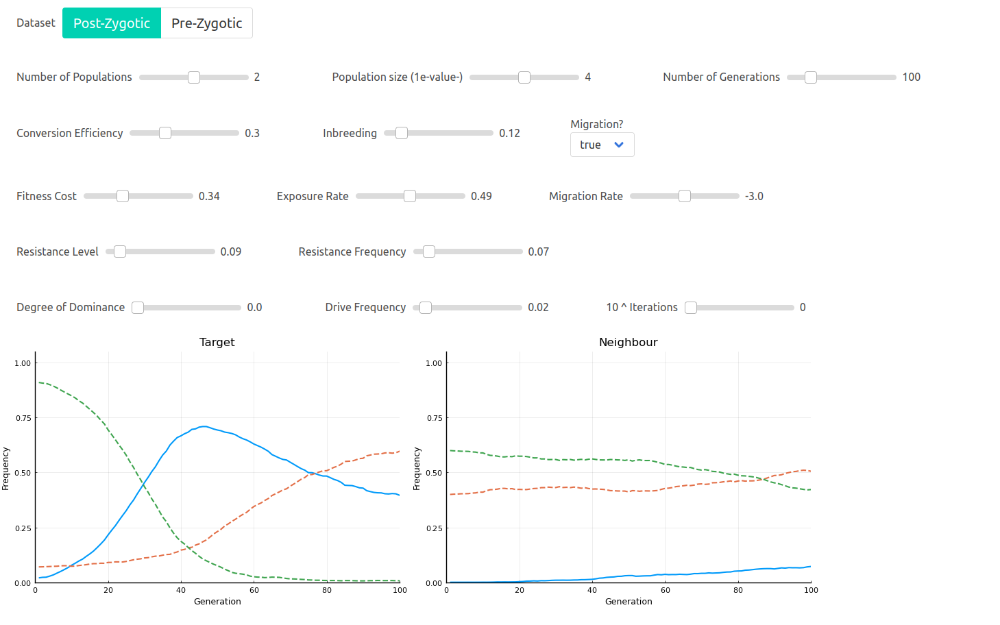

# interactive_gene_drive
Local Interactive Gene Drive Model

Needs at least Julia v1.5 and Plots v1.19

# ReadMe

This script creates an interactive gene drive model at localhost:8000.

## Quick Install
```
/path/to/julia -i /path/to/gene_drive_model_interact_script.jl
```
The script will open your web browser to http://localhost:8000/. This uses python3 so if you dont have that you will have to navigate to http://localhost:8000/ manually. It may take a few minutes the first time to install all the packages.

## Quick Guide
The first time running the script will take some time to install necessary Julia packages. 

Prezygotic/Postzygotic buttons switch between Pre- and Post-zygotix gene drive systems.
Migration switch turns migration on or off
Number of populations sets the number of populations to simulate, between 1 and 2.
Population size sets the number of indiviudals in the populations, in terms of 1x10^value.
Number of Generations sets how many generations to simulate.
Conversion Efficiency is the rate at which the drive converts wild-type (green dashed line).
Inbreeding is the level of inbreeding in the populations.
Migration rate is the percentage of gene flow between the two populations, in terms of 1x10^value.
Selection Coefficient is the fitness cost associated with having the drive construct.
Exposure rate 1 is the percentage of population 1 (target) under selection. (set to 1 if fitness cost is universal).
Exposure rate 2 is the percentage of population 1 (neighour) under selection. (set to 1 if fitness cost is universal).
Resistance level is how resistant the resistace allele (red dashed line) is to the drive. (think of it as the conversion effieicny for the resistance allele).
Resistance Freqeucny 1 is the initial frequency of the resistance allele in population 1 (target).
Resistance Freqeucny 2 is the initial frequency of the resistance allele in population 2 (neighbour).
Degree of dominance is how the selection coefficient is expressed in heterozygotes. (0 is recessive, 0.5 is additive and 1 is dominant)
Drive Frequency is the initial frequency of the gene drive in the target population.
Iterations is how many times each simulation is performed, in terms of 1x10^value.

The solid blue line is the allele frequency of the drive, the green dashed line is the wild-type allele frequency and the red dashed line is the resistance allele frequency.


